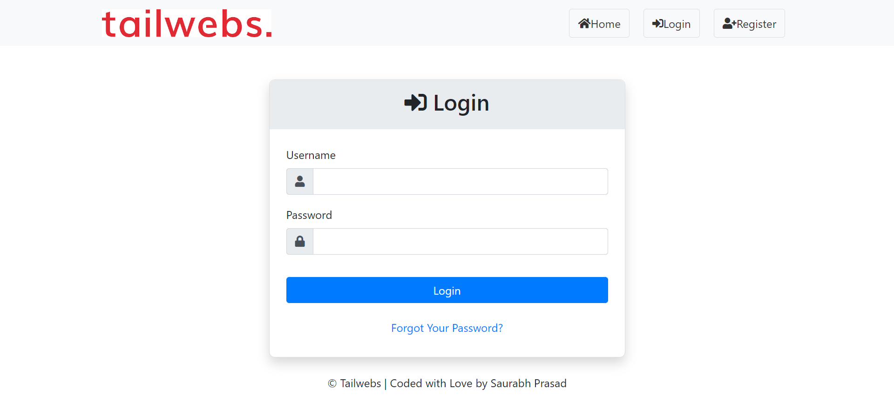
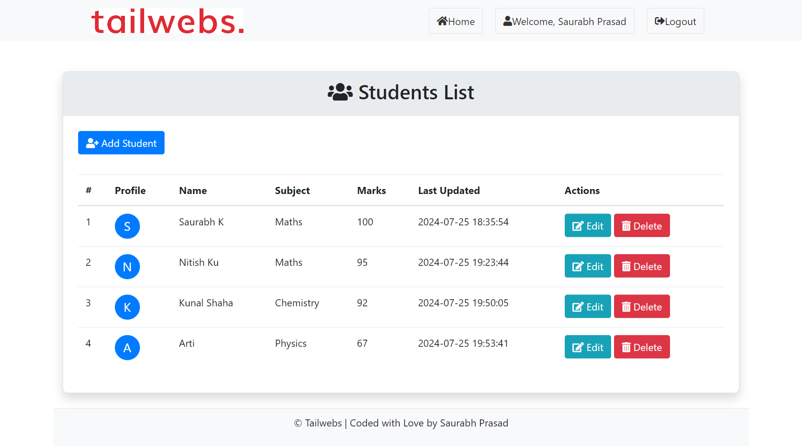
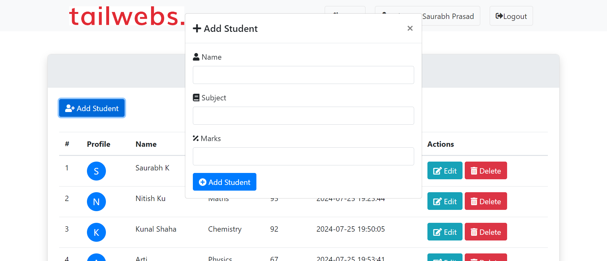
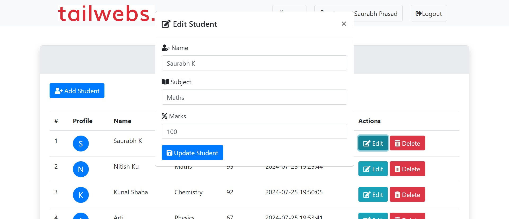
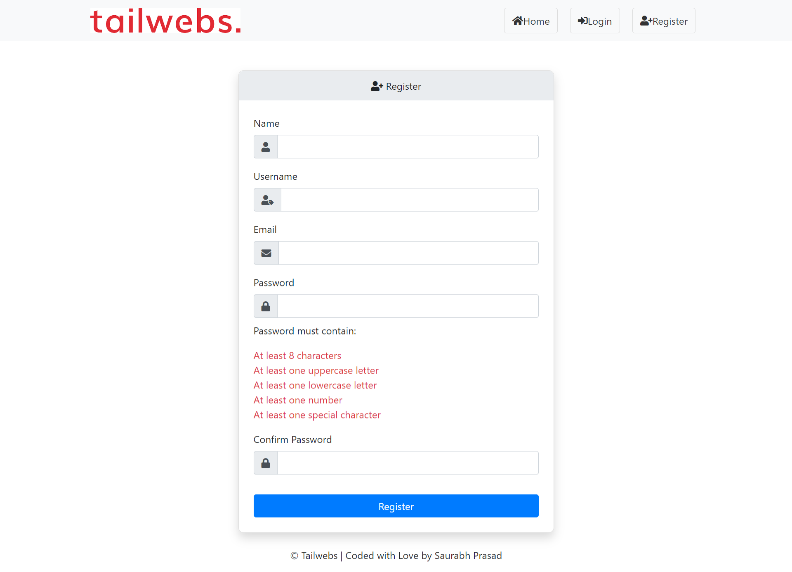

<p align="center"><a href="https://laravel.com" target="_blank"></a></p>

<p align="center">
<a href="https://github.com/laravel/framework/actions"></a>
<a href="https://packagist.org/packages/laravel/framework"></a>
<a href="https://packagist.org/packages/laravel/framework"></a>
<a href="https://packagist.org/packages/laravel/framework"></a>
</p>

# Robust Teacher Portal

The **Robust Teacher Portal** is a web application developed to efficiently manage student information. This project, built with the Laravel PHP framework, includes functionalities such as secure authentication, student management, and dynamic user interfaces. This repository has been created as part of the initial screening process for the PHP Developer position at Tailwebs.com, Bangalore.

## Features

- **Login Functionality:** Secure authentication for teachers.
- **Teacher Portal Home & Student Listing:** View and manage student details with options to edit and delete records.
- **New Student Entry:** Add new students or update existing records with options to check for duplicate entries.

## Prerequisites

Ensure you have the following installed before setting up the project:

- **PHP 8.0 or higher**
- **Composer** (PHP package manager)
- **Node.js** and **npm** (for front-end dependencies)
- **MySQL** or any compatible database

### Install Prerequisites

On Windows 11, you can install the required tools using the following commands:

1. **PHP:** [Download and install PHP](https://windows.php.net/download/)
2. **Composer:** [Download and install Composer](https://getcomposer.org/download/)
3. **Node.js:** [Download and install Node.js](https://nodejs.org/)
4. **MySQL:** [Download and install MySQL](https://dev.mysql.com/downloads/)

## Installation

Follow these steps to set up the project locally:

1. **Clone the Repository**

   ```bash
   git clone https://github.com/skcoil/robust-teacher-portal.git
   ```

2. **Navigate to the Project Directory**

   ```bash
   cd robust-teacher-portal
   ```

3. **Install PHP Dependencies**

   ```bash
   composer install
   ```

4. **Set Up Environment Configuration**

   Copy the example environment configuration file and update it with your database credentials.

   ```bash
   cp .env.example .env
   ```

   Edit the `.env` file to configure your database and other settings.

5. **Generate Application Key**

   ```bash
   php artisan key:generate
   ```

6. **Run Migrations**

   ```bash
   php artisan migrate
   ```

7. **Install Front-End Dependencies**

   ```bash
   npm install
   ```

8. **Build Front-End Assets**

   ```bash
   npm run dev
   ```

9. **Start the Development Server**

   ```bash
   php artisan serve
   ```

   The application will be available at `http://localhost:8000`.

## Usage

- **Login:** Access the login page at `http://localhost:8000/login` and enter your credentials.
- **Manage Students:** After logging in, you will be redirected to the student listing screen where you can view, edit, or delete student records.
- **Add New Students:** Use the modal to add new student records or update existing ones.

## Screenshots

- **Login Screen**

  

- **Teacher Dashboard**

  

- **Add Student Screen**

  

- **Edit Student Screen**

  

- **Registration Screen**

  

## Contributing

Feel free to fork the repository and submit pull requests. Please ensure your contributions adhere to the project's coding standards and include tests for new features.

## License

This project is licensed under the MIT License. See the [LICENSE](LICENSE) file for details.

## Contact

For any questions or feedback, please contact:

- **Saurabh Prasad**: saurabhkpofficial@gmail.com
